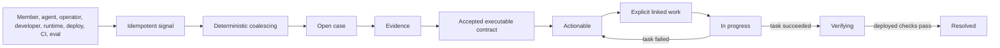

# Improvement cases

Improvement cases are the one lifecycle for anything that says the product or its development process could be better. Member reports, model-detected impediments, operator and developer observations, runtime incidents, deployment anomalies, CI failures, and eval regressions differ only by signal source. They do not create parallel inboxes.

## Core model

- A **case** is the current materialized unit of work: title, classification, severity, owner, status, privacy boundary, and timestamps.
- A **signal** is immutable source provenance plus an active/withdrawn state. Its source key provides exact idempotency.
- **Evidence** supports, contradicts, or leaves the case inconclusive. Large or sensitive source detail remains in the canonical runtime ledger and is referenced rather than copied.
- A **contract** versions expected behavior and acceptance checks. At least one check must be machine-executable before a case becomes actionable.
- A **case event** records each lifecycle decision for the operator stream.

The canonical tables are `improvement_cases`, `improvement_signals`, `improvement_evidence`, `improvement_contracts`, `improvement_verification_proofs`, `improvement_verification_receipts`, and `improvement_case_events`. `src/db/improvementRepository.ts` owns intake and lifecycle state; `src/db/improvementVerificationRepository.ts` owns source proofs and receipt application. `agent_tasks.improvement_case_id` links explicitly authorized code work without turning the task projection into a second case tracker.



## Coalescing

`source_key` is globally unique and makes repeated ingestion harmless. A withdrawn signal with the same key is reactivated instead of duplicated.

Automatic coalescing requires the same guild, privacy boundary, and deterministic fingerprint on an unresolved case. Fingerprints use stable source codes when available and otherwise a bounded normalized summary. Similar titles are suggestions only: `improve suggest` may show same-boundary candidates, but only `improve merge` moves them together. Cross-guild and cross-privacy merges are rejected.

## Authority and privacy

A signal is an observation, never a verdict or authorization. `🐛` creates a private member signal and removing it withdraws that signal. It never starts a sandbox. The model may silently record generalized internal impediments, but it must still answer the member normally.

Member-facing reads are reporter-scoped and current-channel-permission-filtered. A Discord user may link work only to an actionable guild case containing one of their signals, and the current turn must explicitly request code work. Trusted operators manage repository/global cases through the explicit-target CLI. Case summaries and contracts must remain generalized; private prompts, identities, message content, and secrets belong only in retained evidence.

Privacy deletion removes reporter-owned signals and evidence directly linked to those signals or their runtime executions. Empty cases are deleted. Coalesced cases remain only when independent signals or evidence still justify them, and actor identifiers in retained events are cleared.

## Lifecycle invariants

The allowed states are `open`, `needs_evidence`, `actionable`, `in_progress`, `verifying`, `resolved`, and `dismissed`.

- `actionable` requires supporting evidence and an active contract with at least one executable check.
- Work starts only from `actionable`. Enqueue failure restores `actionable`.
- Successful linked work moves to `verifying`; failed, cancelled, or no-diff work returns to `actionable`.
- `resolved` requires a passed receipt for the active contract on an exact durable deployment. The receipt, supporting `deployment_verification` evidence, event, and transition are written atomically.
- Withdrawing the last signal dismisses only an untriaged `open` or `needs_evidence` case. Re-adding the signal reopens that specific automatically dismissed case.
- Resolved and dismissed cases may be reopened explicitly; no hidden retry or request replay occurs at deployment startup.

## Triage

`improve triage <case-id>` is the single read-only triage view. It combines active signal provenance with content-free aggregates from signal-linked runtime executions: terminal status, warning/error counts, terminal tool outcomes, duration, delivery state, and safe event names. It never copies prompts, replies, event summaries, artifact bodies, member identities, or private eval content into the dossier.

Deterministic runtime, deployment, CI, and eval gate failures may be confirmed from their authoritative signal. An ordinary member, agent, operator, or developer report remains `insufficient_evidence` unless its retained runtime aggregates establish a terminal execution, tool, event, or delivery failure. Code never declares a subjective report `not_reproduced`; that verdict requires an explicit operator conclusion.

Known source-owned gates may propose an executable contract. Unknown detector codes and semantic reports require the operator to provide expected behavior and a concrete executable check. This prevents a stable label from masquerading as a runnable acceptance test.

`--apply` performs one transaction: it records the dossier evidence, accepts the confirmed contract when present, updates classification/owner/severity, transitions confirmed cases to `actionable`, inconclusive cases to `needs_evidence`, or explicitly not-reproduced cases to `dismissed`, and appends one audit event. The operation compares the case version and locks the case. Its application key covers the signal snapshot, verdict, evidence, contract, and ownership decision, so concurrent exact retries are harmless while a later materially different conclusion may still be applied. Triage never starts a coding task or publishes anything to GitHub.

## Deployment verification

`improve verify <case-id> --revision <sha>` is read-only by default. It loads the active contract, exact durable deployment ID, case-specific private replay result, and an optional `--execution-id`, then emits one result per check without copying prompt, answer, event-summary, or tool-output content. `--apply` rebuilds the authoritative proof immediately before writing an immutable receipt.

Proof ownership follows the check kind. Tool and answer-text checks use the case-specific private replay recorded by the deployment eval runner, or an explicitly supplied terminal execution from the requested revision. Runtime-event and delivery-state checks require that terminal execution. Repository tests and database invariants use the trusted release admission gates. Known post-deploy canaries use durable promotion. The `revision-quality-gate` remains inconclusive until the scheduled production observation has enough member traffic; it cannot pass merely because pods became ready. Manual or unknown checks remain inconclusive.

A passed receipt atomically records supporting evidence and resolves the case. A failed receipt records contradictory evidence and returns the case to `actionable`. An inconclusive receipt records the missing-proof decision and leaves the case in `verifying`. The receipt key covers the contract version, deployment, optional execution, and every check result, making exact retries harmless. Successful release promotion invokes the verifier automatically, and later production-observation proof re-invokes it for traffic-gated cases. Neither path replays an old member request.

## Operator workflow

Use the configured database explicitly:

```bash
npm run improve -- --target local inbox
npm run improve -- --target local show <case-id>
npm run improve -- --target local triage <case-id>
npm run improve -- --target local triage <case-id> --apply
npm run improve -- --target local triage <case-id> --apply --verdict confirmed --evidence-summary "A focused reproduction confirms the failure." --expected "The focused invariant passes." --check '{"kind":"test","reference":"focused-invariant"}'
npm run improve -- --target local suggest <case-id>
npm run improve -- --target local evidence <case-id> --kind runtime_trace --disposition supports --summary "..."
npm run improve -- --target local contract <case-id> --expected "..." --check '{"kind":"test","reference":"focused-test"}'
npm run improve -- --target local transition <case-id> actionable
npm run improve -- --target local link-task <case-id> --task <task-id>
npm run improve -- --target local verify <case-id> --revision <sha>
npm run improve -- --target local verify <case-id> --revision <sha> --execution-id <execution-id> --apply
```

Production commands require `--target production --confirm-production`, `NODE_ENV=production`, and a non-local configured database host. The CLI refuses a target/database mismatch.

Active prompt-compatible contracts export with `npm run eval:export-improvements`; `npm run eval:regressions` runs the resulting private suite. Other contract kinds stay in their owning test, database, delivery, or deployment harness.
