# Improvement cases

Improvement cases are the one lifecycle for anything that says the product or its development process could be better. Member reports, model-detected impediments, operator and developer observations, runtime incidents, deployment anomalies, CI failures, and eval regressions differ only by signal source. They do not create parallel inboxes.

## Core model

- A **case** is the current materialized unit of work: title, classification, severity, owner, status, privacy boundary, and timestamps.
- A **signal** is immutable source provenance plus an active/withdrawn state. Its source key provides exact idempotency.
- **Evidence** supports, contradicts, or leaves the case inconclusive. Large or sensitive source detail remains in the canonical runtime ledger and is referenced rather than copied.
- A **contract** versions expected behavior and acceptance checks. Every check must resolve to a registered proof adapter before a case becomes actionable.
- A **work attempt** links an authorized execution source to the case. Agent tasks and GitHub pull requests share this record and lifecycle.
- A **case event** records each lifecycle decision for the operator stream.

The canonical tables are `improvement_cases`, `improvement_signals`, `improvement_evidence`, `improvement_contracts`, `improvement_work_attempts`, `improvement_verification_proofs`, `improvement_verification_receipts`, and `improvement_case_events`. `src/db/improvementRepository.ts` owns intake and case lifecycle, `src/db/improvementWorkRepository.ts` owns source-independent work attempts, and `src/db/improvementVerificationRepository.ts` owns source proofs and receipt application. `agent_tasks.improvement_case_id` remains a rolling-deploy projection, not the owner of work linkage.



```mermaid
flowchart LR
  A["Member, agent, operator, developer, runtime, deploy, CI, eval"] --> B["Idempotent signal"]
  B --> C["Deterministic coalescing"]
  C --> D["Open case"]
  D --> E["Evidence"]
  E --> F["Accepted executable contract"]
  F --> G["Actionable"]
  G --> H["Authorized linked work"]
  H --> I["Source-independent work attempt"]
  I --> L["In progress"]
  L -->|"task or PR failed"| G
  L -->|"task succeeded or PR merged"| J["Verifying"]
  J -->|"deployed checks pass"| K["Resolved"]
```

## Coalescing

`source_key` is globally unique and makes repeated ingestion harmless. A withdrawn signal with the same key is reactivated instead of duplicated.

Automatic coalescing requires the same guild, privacy boundary, and deterministic fingerprint on an unresolved case. Fingerprints use stable source codes when available and otherwise a bounded normalized summary. Similar titles are suggestions only: `improve suggest` may show same-boundary candidates, but only `improve merge` moves them together. Cross-guild and cross-privacy merges are rejected.

## Authority and privacy

A signal is an observation, never a defect verdict. A report signal authorizes autonomous assessment and repair: assessment keeps the checkout clean, and only a confirmed machine-executable contract unlocks edits. `🐛` creates a private member signal and removing it withdraws that signal. The model may silently record generalized internal impediments, but it must still answer the member normally.

Member-facing reads are reporter-scoped and current-channel-permission-filtered. Trusted operators manage repository/global cases through the explicit-target CLI. Case summaries and contracts remain generalized; private prompts, identities, message content, and secrets belong only in retained evidence. Assessment requests are private task-ledger data, and public PR metadata is derived only from the verified diff.

Privacy deletion removes reporter-owned signals and evidence directly linked to those signals or their runtime executions. Empty cases are deleted. Coalesced cases remain only when independent signals or evidence still justify them, and actor identifiers in retained events are cleared.

## Lifecycle invariants

The allowed states are `open`, `needs_evidence`, `actionable`, `in_progress`, `verifying`, `resolved`, and `dismissed`.

- `actionable` requires supporting evidence and an active contract whose checks all have registered proof adapters. Private-replay checks additionally require retained requester, channel, prompt, visible-channel scope, and an original execution with no mutating tool use.
- Work starts only from `actionable`, and a case has at most one active work attempt. Enqueue failure or a pull request closed without merging restores `actionable`.
- Successful linked work moves to `verifying`; failed, cancelled, or no-diff work returns to `actionable`.
- `resolved` requires a passed receipt for the active contract on an exact durable deployment. The receipt, supporting `deployment_verification` evidence, event, and transition are written atomically.
- Withdrawing the last signal dismisses only an untriaged `open` or `needs_evidence` case. Re-adding the signal reopens that specific automatically dismissed case.
- Resolved and dismissed cases may be reopened explicitly; no hidden retry or request replay occurs at deployment startup.

## Triage

`improve triage <case-id>` is the single read-only triage view. It combines active signal provenance with content-free aggregates from signal-linked runtime executions: terminal status, warning/error counts, terminal tool outcomes, duration, delivery state, and safe event names. It never copies prompts, replies, event summaries, artifact bodies, member identities, or private eval content into the dossier.

Deterministic runtime, deployment, CI, and eval gate failures may be confirmed from their authoritative signal. Other reports enter an isolated semantic assessment that compares retained request, reply, model/tool, delivery, revision, source, and test evidence. It may dismiss expected behavior or a non-reproducible claim, identify an already-fixed regression, confirm a current defect with an executable contract, or request one exact clarification when neither rejection nor repair is safe.

Known source-owned gates may propose an executable contract. Semantic assessment may propose only registered tool or answer-text checks; invalid or non-executable contracts cannot unlock repair. Unknown automated detector codes still await a registered source-owned contract.

`--apply` performs one transaction: it records the dossier evidence, accepts the confirmed contract when present, updates classification/owner/severity, transitions confirmed cases to `actionable`, inconclusive cases to `needs_evidence`, or explicitly not-reproduced cases to `dismissed`, and appends one audit event. The operation compares the case version and locks the case. Its application key covers the signal snapshot, verdict, evidence, contract, and ownership decision, so concurrent exact retries are harmless while a later materially different conclusion may still be applied. Manual CLI triage never starts work; the worker-owned assessment does so only after its clean evidence gate.

## Automatic reconciliation

The worker runs `improvement.reconcile` immediately at startup, whenever a member report is added or withdrawn, and on the source-controlled schedule. It directly advances trusted automated detections whose stable code maps to a registered proof adapter. For report-backed cases without deterministic failure evidence, the trusted worker hydrates a bounded private evidence packet from the exact linked execution: operative transcript messages, typed events, and the retained model, response, and delivery artifacts referenced by those events. It queues one idempotent `improvement_report` task per signal snapshot and evidence-schema version, so a corrected evidence builder safely reassesses cases left inconclusive by an older packet. The isolated sandbox receives that packet but no production credentials. Rejection dismisses the case; confirmation unlocks a focused repair, verified PR, and auto-merge; only a specific ambiguity, changed signal snapshot, or automation blocker records `reconciliation.awaiting_operator`. Unknown detector codes record `reconciliation.awaiting_contract`.

Each pass also refreshes active GitHub pull-request work, retries verifying cases against the latest durable deployment, and records one `reconciliation.stalled` edge when `in_progress` or `verifying` has not advanced within the configured source-controlled interval. Deterministic assessment task IDs, case-version locks, snapshot keys, triage application keys, work source keys, and verification receipt keys make concurrent or repeated passes harmless. Reconciliation never merges cases, opens GitHub issues, replays an old mutation, copies private evidence into public GitHub state, or resolves a case without the normal deployed receipt.

## Deployment verification

`improve verify <case-id> --revision <sha>` is read-only by default. It loads the active contract, exact durable deployment ID, and source-owned typed proofs, then emits one result per check without copying prompt, answer, event-summary, or tool-output content. `--apply` rebuilds the authoritative proof immediately before writing an immutable receipt. There is no operator-supplied execution override.

Proof ownership follows this closed registry:

| Check | Registered reference or constraint | Producer |
| --- | --- | --- |
| Tool, answer text, runtime event | Installed non-mutating tools; required file inspection is excluded | Read-only case-specific replay after deployment and on the scheduled private-regression run |
| Repository test | `release-verify` | Trusted release-admission CI followed by durable promotion |
| Database invariant | `release-db-verify` | Trusted database admission gate followed by durable promotion |
| Eval | `private-regression-suite` | Successful private-regression deployment stage |
| Deployment canary | A known `post-deploy-*` stage | Durable promotion after the registered canary |
| Delivery or revision quality | `delivered` or `revision-quality-gate` | Traffic-sampled production observation |

Manual checks, unknown references, required mutating tools, and checks with unavailable replay inputs are rejected before `actionable`; they cannot become permanent “collect proof later” states. Private case replays hide mutating tools and remove current-turn mutation authority. The proof row stores only per-check hashes and conclusions plus the canonical replay execution ID. Production observation remains inconclusive until enough member traffic exists; pod readiness alone cannot prove delivery or quality.

A passed receipt atomically records supporting evidence and resolves the case. A failed receipt records contradictory evidence and returns the case to `actionable`. An inconclusive receipt records which adapter and trigger are pending and leaves the case in `verifying`. The receipt key covers the contract version, deployment, automatically linked execution, and every check result, making exact retries harmless. Successful release promotion invokes the verifier automatically. The deployment and scheduled private-regression stages produce case replay proofs and invoke it again when promotion already exists; production observation does the same for traffic-gated cases.

## Operator workflow

Use the configured database explicitly:

```bash
npm run improve -- --target local inbox
npm run improve -- --target local show <case-id>
npm run improve -- --target local triage <case-id>
npm run improve -- --target local triage <case-id> --apply
npm run improve -- --target local triage <case-id> --apply --verdict confirmed --evidence-summary "A focused reproduction confirms the failure." --expected "The repository release gate passes." --check '{"kind":"test","reference":"release-verify"}'
npm run improve -- --target local suggest <case-id>
npm run improve -- --target local evidence <case-id> --kind runtime_trace --disposition supports --summary "..."
npm run improve -- --target local contract <case-id> --expected "..." --check '{"kind":"test","reference":"release-verify"}'
npm run improve -- --target local transition <case-id> actionable
npm run improve -- --target local link-task <case-id> --task <task-id>
npm run improve -- --target local link-pr <case-id> --pr https://github.com/owner/repo/pull/123
npm run improve -- --target local sync-prs
npm run improve -- --target local reconcile
npm run improve -- --target local verify <case-id> --revision <sha>
npm run improve -- --target local verify <case-id> --revision <sha> --apply
```

Production commands require `--target production --confirm-production`, `NODE_ENV=production`, and a non-local configured database host. The CLI refuses a target/database mismatch.

`link-pr` accepts only a pull request in the configured repository and derives its state and revisions from the live GitHub API. Open pull requests move the case to `in_progress`; a closed unmerged pull request returns it to `actionable`; a merged pull request moves it to `verifying`. Exact retries update the same deterministic work attempt. `sync-prs`, the scheduled reconciler, and release promotion refresh active PR attempts so a merged and deployed PR can proceed directly through verification. Reconciliation failures are reported without blocking an otherwise valid release.

Active private-replay contracts export with `npm run eval:export-improvements`; `npm run eval:regressions` runs the resulting read-only private suite. Other registered contract kinds stay in their owning CI, delivery, observation, or deployment producer.
