# Improvement cases

Improvement cases are the one lifecycle for anything that says the product or its development process could be better. Member reports, model-detected impediments, operator and developer observations, runtime incidents, deployment anomalies, CI failures, and eval regressions differ only by signal source. They do not create parallel inboxes.

## Core model

- A **case** is the current materialized unit of work: title, classification, severity, owner, status, privacy boundary, and timestamps.
- A **signal** is immutable source provenance plus an active/withdrawn state. Its source key provides exact idempotency.
- **Evidence** supports, contradicts, or leaves the case inconclusive. Large or sensitive source detail remains in the canonical runtime ledger and is referenced rather than copied.
- A **contract** versions expected behavior and acceptance checks. Every check must resolve to a registered proof adapter before a case becomes actionable.
- A **work attempt** links an authorized execution source to the case. Agent tasks and GitHub pull requests share this record and lifecycle.
- A **reporter conversation** is one channel-scoped follow-up for a distinct reported Discord message. Original reporter signals map into it; it projects case state and the current clarification, but is not a second case lifecycle.
- **Automation health** is a projection on the case itself: current automation state, exact blocker, next action, retry owner and time, and the timestamp of the last material progress. It is not a second lifecycle or run tracker.
- A **case event** records each lifecycle decision for the operator stream.

The canonical tables are `improvement_cases`, `improvement_signals`, `improvement_evidence`, `improvement_contracts`, `improvement_work_attempts`, `improvement_verification_proofs`, `improvement_verification_receipts`, and `improvement_case_events`. Automation health columns live on `improvement_cases`; health refreshes do not change the case version or lifecycle timestamps. `improvement_reporter_conversations` and `improvement_reporter_conversation_signals` are the Discord delivery projection. `src/db/improvementRepository.ts` owns intake and case lifecycle, `src/db/improvementHealthRepository.ts` owns watchdog projection, `src/db/improvementReporterConversationRepository.ts` owns reporter delivery and clarification ingestion, `src/db/improvementWorkRepository.ts` owns source-independent work attempts, and `src/db/improvementVerificationRepository.ts` owns source proofs and receipt application. `agent_tasks.improvement_case_id` remains a rolling-deploy projection, not the owner of work linkage.

```mermaid
flowchart LR
  A["Member, agent, operator, developer, runtime, deploy, CI, eval"] --> B["Idempotent signal"]
  B --> C["Deterministic coalescing"]
  C --> D["Open case"]
  D --> E["Evidence"]
  E --> F["Accepted executable contract"]
  F --> G["Actionable"]
  G --> H["Authorized linked work"]
  H --> I["Source-independent work attempt"]
  I --> L["In progress"]
  L -->|"task or PR failed"| G
  L -->|"task succeeded or PR merged"| J["Verifying"]
  J -->|"deployed checks pass"| K["Resolved"]
```



## Coalescing

`source_key` is globally unique and makes repeated ingestion harmless. A withdrawn signal with the same key is reactivated instead of duplicated.

Automatic coalescing requires the same guild, privacy boundary, and deterministic fingerprint on an unresolved case. Fingerprints use stable source codes when available and otherwise a bounded normalized summary. Prompt- and reply-side member reports linked to the same canonical execution share its deterministic fingerprint. Similar titles are suggestions only: `improve suggest` may show same-boundary candidates, but only `improve merge` moves them together. Cross-guild and cross-privacy merges are rejected.

Production quality detections fingerprint the actual root cluster, not the deployment-wide gate or its wrapper events. One exact execution/root pair is one idempotent signal. The cluster reference excludes the revision, so recurrence of the same typed event/error, terminal tool outcome, delivery state, answer state, or aggregate metric coalesces into the same unresolved case across deployments. Different root dimensions remain different cases. Canonical execution IDs stay on private signals and never appear in public quality summaries.

## Authority and privacy

A signal is an observation, never a defect verdict. A report signal authorizes autonomous assessment and repair: assessment keeps the checkout clean, and only a confirmed machine-executable contract unlocks edits. `🐛` is visible to members who can see the source channel; it creates a private durable member signal, and removing it withdraws that signal. The model may silently record generalized internal impediments, but it must still answer the member normally.

Member-facing reads are reporter-scoped and current-channel-permission-filtered. Trusted operators manage repository/global cases through the explicit-target CLI. Case summaries and contracts remain generalized; private prompts, identities, message content, and secrets belong only in retained evidence. Assessment requests are private task-ledger data, and public PR metadata is derived only from the verified diff.

Privacy deletion removes reporter-owned signals, orphaned conversation projections, and evidence directly linked to those signals or their runtime executions. Empty cases are deleted. Shared conversations remain only while another independent reporter signal maps to them; coalesced cases remain only when independent signals or evidence still justify them, and actor identifiers in retained events are cleared.

## Lifecycle invariants

The allowed states are `open`, `needs_evidence`, `actionable`, `in_progress`, `verifying`, `resolved`, and `dismissed`.

- `actionable` requires supporting evidence and an active contract whose checks all have registered proof adapters. Private-replay checks additionally require retained requester, channel, prompt, visible-channel scope, and an original execution with no mutating tool use.
- Work starts only from `actionable`, and a case has at most one active work attempt. Enqueue failure or a pull request closed without merging restores `actionable`.
- Successful linked work moves to `verifying`; failed, cancelled, or no-diff work returns to `actionable`.
- `resolved` requires a passed receipt for the active contract on an exact durable deployment. The receipt, supporting `deployment_verification` evidence, event, and transition are written atomically.
- Withdrawing the last signal dismisses only an untriaged `open` or `needs_evidence` case. Re-adding the signal reopens that specific automatically dismissed case.
- Resolved and dismissed cases may be reopened explicitly; no hidden retry or request replay occurs at deployment startup.

## Triage

`improve triage <case-id>` is the single read-only triage view. It combines active signal provenance with content-free aggregates from signal-linked runtime executions: terminal status, warning/error counts, terminal tool outcomes, duration, delivery state, and safe event names. It never copies prompts, replies, event summaries, artifact bodies, member identities, or private eval content into the dossier.

Deterministic runtime, deployment, CI, and eval gate failures may be confirmed from their authoritative signal. Other reports enter an isolated semantic assessment that compares retained request, reply, model/tool, delivery, revision, source, and test evidence. It may dismiss expected behavior or a non-reproducible claim, identify an already-fixed regression, confirm a current defect with an executable contract, or request one exact clarification when neither rejection nor repair is safe.

Known source-owned gates may propose an executable contract. Semantic assessment may propose only registered tool or answer-text checks; invalid or non-executable contracts cannot unlock repair. Unknown automated detector codes still await a registered source-owned contract.

`--apply` performs one transaction: it records the dossier evidence, accepts the confirmed contract when present, updates classification/owner/severity, transitions confirmed cases to `actionable`, inconclusive cases to `needs_evidence`, or explicitly not-reproduced cases to `dismissed`, and appends one audit event. The operation compares the case version and locks the case. Its application key covers the signal snapshot, verdict, evidence, contract, and ownership decision, so concurrent exact retries are harmless while a later materially different conclusion may still be applied. Manual CLI triage never starts work; the worker-owned assessment does so only after its clean evidence gate.

## Automatic reconciliation

The worker runs `improvement.reconcile` immediately at startup, whenever a member report is added, withdrawn, or clarified, and on the source-controlled schedule. It directly advances trusted automated detections whose stable code maps to a registered proof adapter. Once such a detection has an accepted executable contract, the worker queues a distinct `improvement_repair` task immediately; it does not wait for a member report or repeat semantic triage. The task identity covers the signal snapshot, evidence schema, and active contract version so exact passes are idempotent while changed evidence or acceptance criteria produce fresh work. A report on either the member prompt or assistant reply resolves to the same canonical execution. For report-backed cases without deterministic failure evidence, the trusted worker hydrates a bounded private evidence packet from the reported message's signal-scoped archived channel context and, when linked, the exact execution's operative transcript messages, typed events, and retained model, response, and delivery artifacts. It queues one idempotent `improvement_report` task per signal snapshot and evidence-schema version. A pending reporter clarification suppresses duplicate assessment. Failed or cancelled assessment, report-authorized repair, and automated repair tasks get deterministic bounded retries; after three failed attempts the case becomes operator-blocked. The isolated sandbox receives the accepted contract and bounded evidence packet but no production credentials. Rejection dismisses a report-backed case; confirmation or a trusted automated contract unlocks a focused repair, verified PR, and auto-merge. Each reported source message has a durable but initially silent conversation projection. It becomes visible only for an unanswered clarification or when repair reaches `in_progress`, `verifying`, or `resolved`; ordinary `open`, evidence gathering without a question, `actionable`, and dismissed cases do not create a thread or DM. The first visible turn creates one standalone public thread in the canonical `DISCORD_BOT_CHANNEL_ID` and mentions the reporter. Deployment announcements use the same configured channel. Once delivery exists, the same conversation continues through every later lifecycle turn. The bot channel controls the thread audience, and visible turns never copy retained source content automatically. An unconfigured or unavailable channel, a guild mismatch, missing reporter access, or thread creation failure falls back to an explicit-reply DM. Already delivered conversations stay in their existing thread. A natural member reply in the dedicated report thread—or an explicit reply in the fallback DM—becomes a new private signal on the same case, changes its snapshot, and wakes reassessment automatically. Superseded assessments are ignored. `reconciliation.awaiting_operator` is reserved for exhausted bounded retries, a concrete automation blocker, failed thread-and-DM delivery, or ambiguity that members cannot resolve. Unknown detector codes record `reconciliation.awaiting_contract`.

Each pass also refreshes active GitHub pull-request work, retries verifying cases against the latest durable deployment, and refreshes the case's durable automation health. The health projection distinguishes progressing, waiting, blocked, and complete; names the next action and registered retry trigger; and advances its progress clock only when the underlying task, work attempt, clarification, or verification receipt changes. `reconciliation.stalled` therefore means no material progress for the configured interval, not merely an old case timestamp. Waiting for a reporter, automated repair retry, PR merge, deployment promotion, reconciliation pass, or traffic-backed production observation remains explicit and inspectable. Deterministic assessment and repair task IDs, case-version locks, snapshot keys, triage application keys, work source keys, and verification receipt keys make concurrent or repeated passes harmless. Reconciliation never merges cases, opens GitHub issues, replays an old mutation, copies private evidence into public GitHub state, or resolves a case without the normal deployed receipt.

## Deployment verification

`improve verify <case-id> --revision <sha>` is read-only by default. It loads the active contract, exact durable deployment ID, and source-owned typed proofs, then emits one result per check without copying prompt, answer, event-summary, or tool-output content. `--apply` rebuilds the authoritative proof immediately before writing an immutable receipt. There is no operator-supplied execution override.

Proof ownership follows this closed registry:

| Check | Registered reference or constraint | Producer |
| --- | --- | --- |
| Tool, answer text, runtime event | Installed non-mutating tools; required file inspection is excluded | Read-only case-specific replay after deployment and on the scheduled private-regression run |
| Repository test | `release-verify` | Trusted release-admission CI followed by durable promotion |
| Database invariant | `release-db-verify` | Trusted database admission gate followed by durable promotion |
| Eval | `private-regression-suite` | Successful private-regression deployment stage |
| Deployment canary | A known `post-deploy-*` stage | Durable promotion after the registered canary |
| Delivery or revision quality | `delivered`, `revision-quality-gate`, or an exact `revision-quality:<kind>:<digest>` root cluster | Traffic-sampled production observation |

Manual checks, unknown references, required mutating tools, and checks with unavailable replay inputs are rejected before `actionable`; they cannot become permanent “collect proof later” states. Private case replays hide mutating tools and remove current-turn mutation authority. The proof row stores only per-check hashes and conclusions plus the canonical replay execution ID. A root-cluster contract fails when that exact cluster recurs on the candidate deployment, passes only after both the minimum answer and tool samples exist without recurrence, and otherwise remains inconclusive. Active aggregate metric violations count as present clusters even though they have no single execution reference. The deployment-wide gate remains available for aggregate delivery and quality contracts. Pod readiness alone cannot prove delivery or quality.

A passed receipt atomically records supporting evidence and resolves the case. A failed receipt records contradictory evidence and returns the case to `actionable`. An inconclusive receipt records which adapter and trigger are pending and leaves the case in `verifying`. The receipt key covers the contract version, deployment, automatically linked execution, and every check result, making exact retries harmless. Successful release promotion invokes the verifier automatically. The deployment and scheduled private-regression stages produce case replay proofs and invoke it again when promotion already exists; production observation does the same for traffic-gated cases.

## Operator workflow

Use the configured database explicitly:

```bash
npm run improve -- --target local inbox
npm run improve -- --target local show <case-id>
npm run improve -- --target local triage <case-id>
npm run improve -- --target local triage <case-id> --apply
npm run improve -- --target local triage <case-id> --apply --verdict confirmed --evidence-summary "A focused reproduction confirms the failure." --expected "The repository release gate passes." --check '{"kind":"test","reference":"release-verify"}'
npm run improve -- --target local suggest <case-id>
npm run improve -- --target local evidence <case-id> --kind runtime_trace --disposition supports --summary "..."
npm run improve -- --target local contract <case-id> --expected "..." --check '{"kind":"test","reference":"release-verify"}'
npm run improve -- --target local transition <case-id> actionable
npm run improve -- --target local link-task <case-id> --task <task-id>
npm run improve -- --target local link-pr <case-id> --pr https://github.com/owner/repo/pull/123
npm run improve -- --target local sync-prs
npm run improve -- --target local reconcile
npm run improve -- --target local verify <case-id> --revision <sha>
npm run improve -- --target local verify <case-id> --revision <sha> --apply
```

Production commands require `--target production --confirm-production`, `NODE_ENV=production`, and a non-local configured database host. The CLI refuses a target/database mismatch.

`inbox` includes each case's automation health, and `show` returns it beside the complete case record. Inspect `blocker`, `nextAction`, `retryTrigger`, and `lastProgressAt` before intervening. A `waiting` case already has a durable wakeup owner; operator work is required only when the state is `blocked` or the named retry owner is itself unhealthy.

`link-pr` accepts only a pull request in the configured repository and derives its state and revisions from the live GitHub API. Open pull requests move the case to `in_progress`; a closed unmerged pull request returns it to `actionable`; a merged pull request moves it to `verifying`. Exact retries update the same deterministic work attempt. `sync-prs`, the scheduled reconciler, and release promotion refresh active PR attempts so a merged and deployed PR can proceed directly through verification. Reconciliation failures are reported without blocking an otherwise valid release.

Active private-replay contracts export with `npm run eval:export-improvements`; `npm run eval:regressions` runs the resulting read-only private suite. Other registered contract kinds stay in their owning CI, delivery, observation, or deployment producer.
